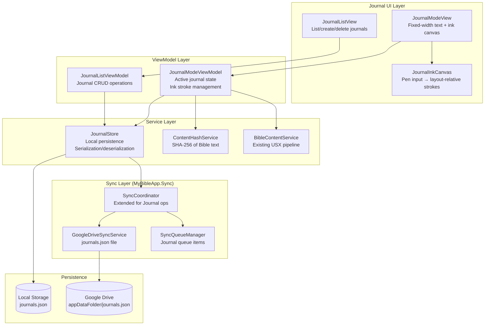

# Design Document: Journal Annotation Mode

## Overview

Journal Annotation Mode introduces a dedicated reading and note-taking workspace within the Bible app. Users create named "journals" that lock Bible text to a fixed-width layout with generous margins, providing stable space for freehand pen annotations. Because the layout geometry (column width, margins, font metrics) and content (translation + content hash) are frozen at creation time, pen strokes remain spatially stable across devices and window resizes.

The feature integrates with the existing ink infrastructure (`InkOverlayCanvas`, `BibleInkStroke`) and sync pipeline (`SyncCoordinator`, `FileSyncQueueManager`, Google Drive `appDataFolder`) to persist and sync journal data alongside other user data.

### Key Design Decisions

1. **Fixed-geometry rendering**: Journal text is rendered at a constant DIP width regardless of viewport. If the viewport is narrower, horizontal scrolling is enabled rather than reflowing text.
2. **Content hash verification**: A SHA-256 hash of the Bible text at creation time detects translation updates that could misalign strokes.
3. **Layout-relative coordinates**: Ink strokes are stored relative to the journal layout origin (top-left of the fixed-width area), not viewport coordinates, ensuring cross-device stability.
4. **Dedicated sync file**: Journal data lives in `journals.json` in the Google Drive `appDataFolder`, separate from `user_data.json` and `annotations.json`.
5. **Reuse of existing ink engine**: The `InkOverlayCanvas` rendering approach (Skia-based, pen-only input, content-space coordinates) is adapted for the journal's fixed coordinate system.

## Architecture



### Integration with Existing Architecture

- **AppShellView** gains a navigation path to `JournalListView` (journal management) and `JournalModeView` (active journal).
- **SyncCoordinator** is extended with `SyncJournalDataAsync()` and handles `"Journal"` operation type in `ProcessQueuedOperationAsync`.
- **GoogleDriveSyncService** gains `GetJournalDataAsync()` / `SaveJournalDataAsync()` methods operating on `journals.json`.
- **SharedSyncRuntime** exposes the `IJournalStore` instance so ViewModels can access it without DI.

## Components and Interfaces

### IJournalStore

```csharp
public interface IJournalStore
{
    /// <summary>Creates a new journal. Returns the created journal or an error.</summary>
    Task<Result<Journal>> CreateJournalAsync(JournalCreateRequest request);

    /// <summary>Gets all journals for the current user, ordered by creation date descending.</summary>
    Task<IReadOnlyList<Journal>> GetAllJournalsAsync();

    /// <summary>Gets a single journal by ID.</summary>
    Task<Journal?> GetJournalAsync(string journalId);

    /// <summary>Deletes a journal and all its ink strokes.</summary>
    Task<Result> DeleteJournalAsync(string journalId);

    /// <summary>Renames a journal.</summary>
    Task<Result> RenameJournalAsync(string journalId, string newName);

    /// <summary>Saves ink strokes for a journal (full replacement).</summary>
    Task<Result> SaveInkStrokesAsync(string journalId, IReadOnlyList<JournalInkStroke> strokes);

    /// <summary>Loads ink strokes for a journal.</summary>
    Task<IReadOnlyList<JournalInkStroke>> GetInkStrokesAsync(string journalId);

    /// <summary>Gets the full journal data snapshot for sync.</summary>
    Task<JournalDataSnapshot> GetSnapshotAsync();

    /// <summary>Merges remote journal data using last-write-wins per journal.</summary>
    Task MergeRemoteAsync(JournalDataSnapshot remote);
}
```

### IContentHashService

```csharp
public interface IContentHashService
{
    /// <summary>
    /// Computes a deterministic SHA-256 hash of the Bible text for a given passage and translation.
    /// </summary>
    string ComputeHash(IReadOnlyList<BibleParagraph> paragraphs);

    /// <summary>
    /// Verifies that the current text matches a previously stored hash.
    /// </summary>
    bool Verify(IReadOnlyList<BibleParagraph> paragraphs, string storedHash);
}
```

### JournalModeViewModel

```csharp
public class JournalModeViewModel : ViewModelBase
{
    // The active journal being displayed
    public Journal? ActiveJournal { get; }

    // Layout parameters from the journal
    public JournalLayout Layout { get; }

    // Bible paragraphs loaded for this journal
    public IReadOnlyList<BibleParagraph> Paragraphs { get; }

    // Ink strokes for the active journal
    public ObservableCollection<JournalInkStroke> InkStrokes { get; }

    // Content hash verification result
    public bool ContentHashValid { get; }
    public bool ShowContentHashWarning { get; }

    // Commands
    public Task OpenJournalAsync(string journalId);
    public Task SaveStrokeAsync(JournalInkStroke stroke);
    public Task EraseStrokeAsync(string strokeId);
    public Task UndoLastStrokeAsync();
}
```

### JournalInkCanvas

A custom Avalonia `Control` similar to `InkOverlayCanvas` but operating in the journal's fixed coordinate system:

- Accepts only pen-type pointer input (touch and mouse are ignored for inking).
- Stores points in layout-relative coordinates (origin = top-left of the journal layout area).
- Supports pen, highlighter, and eraser modes.
- Renders strokes using Skia with the same highlight-multiply blend approach as `InkOverlayCanvas`.
- Eraser removes entire strokes when the pen passes within 14 DIPs of any recorded point.

### JournalListViewModel

```csharp
public class JournalListViewModel : ViewModelBase
{
    public ObservableCollection<JournalSummary> Journals { get; }

    public Task CreateJournalAsync(string name, string translationId,
        string bookCode, int startChapter, int startVerse,
        int endChapter, int endVerse);
    public Task DeleteJournalAsync(string journalId);
    public Task RenameJournalAsync(string journalId, string newName);
    public Task RefreshAsync();
}
```

## Data Models

### Journal

```csharp
public sealed class Journal
{
    public string Id { get; init; }              // GUID
    public string Name { get; init; }            // 1-100 chars, unique per user (case-insensitive)
    public string TranslationId { get; init; }   // e.g. "eng_bsb"
    public string TranslationVersionDate { get; init; } // ISO date of translation at creation
    public string BookCode { get; init; }        // e.g. "JHN"
    public int StartChapter { get; init; }
    public int StartVerse { get; init; }
    public int EndChapter { get; init; }
    public int EndVerse { get; init; }
    public string ContentHash { get; init; }     // SHA-256 hex string
    public JournalLayout Layout { get; init; }
    public DateTime CreatedAtUtc { get; init; }
    public DateTime LastModifiedUtc { get; set; }
}
```

### JournalLayout

```csharp
public sealed class JournalLayout
{
    public double TextColumnWidthDip { get; init; }  // Fixed text column width in DIPs
    public double LeftMarginDip { get; init; }       // Left margin width in DIPs
    public double RightMarginDip { get; init; }      // Right margin width in DIPs
    public string FontFamily { get; init; }          // e.g. "Segoe UI"
    public double FontSizeDip { get; init; }         // Font size in DIPs
    public double LineHeightDip { get; init; }       // Line height in DIPs

    /// <summary>Total width = LeftMargin + TextColumn + RightMargin</summary>
    public double TotalWidthDip => LeftMarginDip + TextColumnWidthDip + RightMarginDip;
}
```

### JournalInkStroke

```csharp
public sealed class JournalInkStroke
{
    public string Id { get; init; }                  // GUID for identification/erasure
    public IReadOnlyList<StrokePoint> Points { get; init; }  // Layout-relative coordinates
    public string Color { get; init; }               // Hex color string e.g. "#FFD700"
    public double StrokeWidth { get; init; }         // Width in DIPs
    public bool IsHighlight { get; init; }           // True = multiply blend mode
}

public readonly record struct StrokePoint(double X, double Y);
```

### JournalDataSnapshot (for sync)

```csharp
public sealed class JournalDataSnapshot
{
    public List<JournalEntry> Journals { get; init; } = [];
    public DateTime LastModifiedUtc { get; init; }
}

public sealed class JournalEntry
{
    public Journal Metadata { get; init; }
    public List<JournalInkStroke> InkStrokes { get; init; } = [];
}
```

### JournalCreateRequest

```csharp
public sealed class JournalCreateRequest
{
    public string Name { get; init; }
    public string TranslationId { get; init; }
    public string BookCode { get; init; }
    public int StartChapter { get; init; }
    public int StartVerse { get; init; }
    public int EndChapter { get; init; }
    public int EndVerse { get; init; }
    public JournalLayout Layout { get; init; }
}
```

### Result Types

```csharp
public sealed class Result
{
    public bool IsSuccess { get; init; }
    public string? ErrorMessage { get; init; }

    public static Result Success() => new() { IsSuccess = true };
    public static Result Failure(string message) => new() { IsSuccess = false, ErrorMessage = message };
}

public sealed class Result<T>
{
    public bool IsSuccess { get; init; }
    public T? Value { get; init; }
    public string? ErrorMessage { get; init; }

    public static Result<T> Success(T value) => new() { IsSuccess = true, Value = value };
    public static Result<T> Failure(string message) => new() { IsSuccess = false, ErrorMessage = message };
}
```


## Correctness Properties

*A property is a characteristic or behavior that should hold true across all valid executions of a system — essentially, a formal statement about what the system should do. Properties serve as the bridge between human-readable specifications and machine-verifiable correctness guarantees.*

### Property 1: Journal creation produces complete metadata

*For any* valid journal creation request (name 1-100 chars, valid translation ID, valid passage reference, valid layout dimensions), the created Journal SHALL contain a non-empty unique ID, the exact user-provided name, the specified translation ID, the passage reference, a non-empty content hash, the translation version date, and all three layout dimensions (text column width, left margin, right margin) matching the request.

**Validates: Requirements 1.1, 1.2, 1.3, 1.4**

### Property 2: Duplicate journal name rejection

*For any* existing journal name and any case-variant of that name (uppercase, lowercase, mixed case), attempting to create a new journal with the case-variant name SHALL be rejected with an error indicating the name is already in use, and the journal store SHALL remain unchanged.

**Validates: Requirements 1.5**

### Property 3: Invalid journal name rejection

*For any* string that is empty (length 0) or exceeds 100 characters, attempting to create a journal with that name SHALL be rejected with an error indicating the name length constraint, and the journal store SHALL remain unchanged.

**Validates: Requirements 1.6**

### Property 4: Content hash determinism and verification

*For any* list of Bible paragraphs, computing the content hash twice SHALL produce the same result. Furthermore, *for any* list of paragraphs and its computed hash, verifying the hash against the same paragraphs SHALL return true, and verifying against any modified set of paragraphs (with at least one character difference) SHALL return false.

**Validates: Requirements 2.4**

### Property 5: Layout-relative coordinate storage

*For any* pen stroke completed in journal mode at any viewport position and any scroll offset, the stored JournalInkStroke points SHALL be in layout-relative coordinates (relative to the journal layout origin), independent of the viewport position and scroll state at the time of drawing.

**Validates: Requirements 3.3, 3.4**

### Property 6: Stroke persistence round-trip

*For any* set of JournalInkStrokes saved to a journal, loading the strokes for that journal SHALL return all saved strokes with identical point data, color, width, and highlight flag.

**Validates: Requirements 3.5**

### Property 7: Eraser hit detection correctness

*For any* JournalInkStroke and any erase point, the stroke SHALL be removed if and only if the erase point is within 14 DIPs (Euclidean distance) of at least one recorded point in that stroke.

**Validates: Requirements 3.7**

### Property 8: Stroke isolation by journal

*For any* set of journals (including journals covering overlapping Bible passages), adding, removing, or modifying ink strokes in one journal SHALL NOT affect the ink strokes stored in any other journal. Each journal's strokes SHALL be independently retrievable and unmodified by operations on other journals.

**Validates: Requirements 4.2, 6.1, 6.5**

### Property 9: Last-write-wins merge correctness

*For any* two JournalDataSnapshots (local and remote) containing journals with overlapping IDs, the merge result for each journal SHALL be the version with the later `LastModifiedUtc` timestamp. Journals present only in one snapshot SHALL be preserved in the merge result.

**Validates: Requirements 4.4, 5.4**

### Property 10: Journal mutations enqueue sync operations

*For any* journal mutation (create, rename, delete, add stroke, erase stroke), the sync queue SHALL contain a new pending operation of type "Journal" after the mutation completes.

**Validates: Requirements 5.3**

### Property 11: Journal list sorted by creation date descending

*For any* set of journals with distinct creation dates, retrieving the journal list SHALL return them sorted by creation date in descending order (most recent first).

**Validates: Requirements 6.2**

### Property 12: Ink stroke serialization round-trip

*For any* valid JournalInkStroke object (with any number of points, any valid color string, any positive stroke width, and any highlight flag), serializing to JSON and then deserializing SHALL produce an object with identical stroke ID, point coordinates (preserved to at least two decimal places), color, stroke width, and highlight flag.

**Validates: Requirements 8.1, 8.2, 8.3, 8.5**

### Property 13: Malformed JSON produces descriptive errors

*For any* JSON object that is missing one or more required JournalInkStroke fields (id, points, color, strokeWidth), deserialization SHALL return a descriptive error indicating which field is missing or invalid, rather than silently producing a default or partial object.

**Validates: Requirements 8.4**

## Error Handling

### Journal Creation Errors

| Condition | Behavior |
|-----------|----------|
| Name empty or > 100 chars | Return `Result.Failure` with length constraint message |
| Duplicate name (case-insensitive) | Return `Result.Failure` with "name already in use" message |
| Bible text unavailable | Return `Result.Failure` with "passage content could not be retrieved" message |
| Storage write failure | Return `Result.Failure` with storage error details |

### Journal Open Errors

| Condition | Behavior |
|-----------|----------|
| Content hash mismatch | Set `ShowContentHashWarning = true`, allow user to continue |
| Translation unavailable / timeout (10s) | Display error, do not render partial text |
| Ink stroke load failure | Display error indication, allow continued use without failed strokes |
| Missing font family | Display warning identifying the missing font |

### Ink Persistence Errors

| Condition | Behavior |
|-----------|----------|
| Local storage write failure | Retain stroke in memory, retry on next save, indicate unsaved changes |
| Deserialization failure (remote data) | Preserve local data unchanged, report sync error via `SyncProgress` event |

### Sync Errors

| Condition | Behavior |
|-----------|----------|
| Network unavailable | Queue operation for retry when connectivity restored (up to 5 retries) |
| Transient push failure | Retain queued operation, retry on next sync cycle |
| Partial deletion failure | Retain journal in pre-deletion state, inform user |

### Error Propagation Pattern

Errors follow the existing app pattern:
1. Service layer returns `Result` / `Result<T>` with error messages.
2. ViewModel layer translates results into UI state (warning flags, error messages).
3. View layer binds to ViewModel error state and displays appropriate UI.
4. Sync errors propagate through `SyncProgressEventArgs` to the debug log and status display.

## Testing Strategy

### Property-Based Tests (FsCheck for .NET)

The project will use **FsCheck** (with xUnit integration via `FsCheck.Xunit`) for property-based testing. Each property test runs a minimum of 100 iterations with generated inputs.

**Test configuration:**
- Library: `FsCheck.Xunit` (NuGet package)
- Minimum iterations: 100 per property
- Tag format: `// Feature: journal-annotation-mode, Property {N}: {title}`

**Properties to implement:**

| Property | Test Focus | Key Generators |
|----------|-----------|----------------|
| 1: Creation completeness | `JournalStore.CreateJournalAsync` | Random names (1-100 chars), layout dimensions, passage refs |
| 2: Duplicate name rejection | `JournalStore.CreateJournalAsync` | Random names + case variants |
| 3: Invalid name rejection | `JournalStore.CreateJournalAsync` | Empty strings, strings > 100 chars |
| 4: Content hash determinism | `ContentHashService.ComputeHash/Verify` | Random paragraph lists |
| 5: Layout-relative coordinates | `JournalInkCanvas` coordinate transform | Random viewport points + scroll offsets |
| 6: Stroke persistence round-trip | `JournalStore.SaveInkStrokesAsync/GetInkStrokesAsync` | Random stroke sets |
| 7: Eraser hit detection | Eraser logic | Random strokes + erase points at various distances |
| 8: Stroke isolation | Multi-journal operations | Random journals with overlapping passages |
| 9: Last-write-wins merge | `JournalStore.MergeRemoteAsync` | Pairs of snapshots with varying timestamps |
| 10: Mutations enqueue sync | All mutation methods | Random mutations |
| 11: List sorting | `JournalStore.GetAllJournalsAsync` | Journals with random creation dates |
| 12: Serialization round-trip | JSON serialize/deserialize | Random `JournalInkStroke` objects |
| 13: Malformed JSON errors | Deserialization | JSON with randomly removed fields |

### Unit Tests (xUnit)

Unit tests cover specific examples, edge cases, and integration points:

- **Journal creation**: Specific valid/invalid name examples, boundary cases (exactly 1 char, exactly 100 chars, 101 chars)
- **Content hash**: Known input → known hash value (regression)
- **Eraser**: Boundary case at exactly 14 DIPs distance
- **Sync integration**: Mock `GoogleDriveSyncService` to verify `journals.json` file operations
- **Error scenarios**: Storage failures, network timeouts, malformed data

### Integration Tests

- End-to-end journal lifecycle: create → annotate → save → close → reopen → verify strokes
- Sync round-trip: local change → push to mock Drive → pull on "second device" → verify
- Content hash warning flow: modify Bible text between sessions → verify warning on open

### Test Project Structure

Tests live in a new project `MyBibleApp.Journal.Tests` (or extend `MyBibleApp.Sync.Tests` for sync-related tests):

```
MyBibleApp.Journal.Tests/
├── Properties/
│   ├── JournalCreationProperties.cs
│   ├── InkStrokeSerializationProperties.cs
│   ├── ContentHashProperties.cs
│   ├── EraserHitDetectionProperties.cs
│   ├── MergeProperties.cs
│   └── StrokeIsolationProperties.cs
├── Unit/
│   ├── JournalStoreTests.cs
│   ├── ContentHashServiceTests.cs
│   └── JournalModeViewModelTests.cs
├── Integration/
│   ├── JournalSyncIntegrationTests.cs
│   └── JournalLifecycleTests.cs
└── Generators/
    ├── JournalGenerators.cs
    └── InkStrokeGenerators.cs
```
