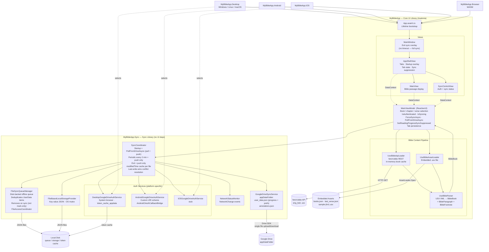
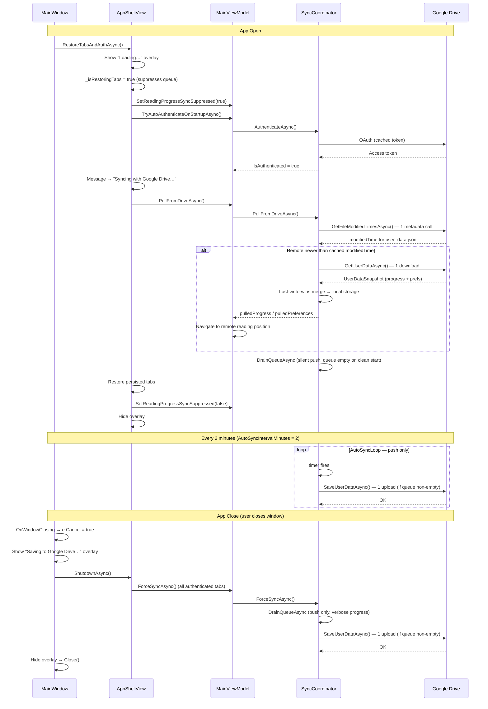
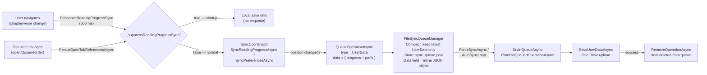

# Architecture

## Component Overview

```mermaid
graph TB
    Desktop["MyBibleApp.Desktop\nWindows / Linux / macOS"]
    Android["MyBibleApp.Android"]
    iOS["MyBibleApp.iOS"]
    Browser["MyBibleApp.Browser\nWASM"]

    subgraph Core["MyBibleApp — Core UI Library (Avalonia)"]
        App["App.axaml.cs\nLifetime bootstrap"]

        subgraph Views["Views"]
            MainWindow["MainWindow\nExit sync overlay\n(no timeout — full sync)"]
            AppShell["AppShellView\nTabs · Startup overlay\nTab state · Sync suppression"]
            MainView["MainView\nBible passage display"]
            SyncCtrl["SyncControlView\nAuth + sync status"]
        end

        MainVM["MainViewModel  (ReactiveUI)\nBook / chapter / verse selection\nIsAuthenticated · IsSyncing\nForceSyncAsync · PullFromDriveAsync\nSetReadingProgressSyncSuppressed\nTab persistence"]

        subgraph BiblePipeline["Bible Content Pipeline"]
            ApiLoader["UsxBibleApiLoader\nfetch.bible REST\nin-memory book cache"]
            AssetLoader["UsxBibleAssetLoader\nEmbedded .usx file"]
            Parser["UsxBibleParser\nUSX XML → BibleBook\n+ BibleParagraph + BibleFootnote"]
        end
    end

    subgraph SyncLib["MyBibleApp.Sync — Sync Library (no UI deps)"]
        Coordinator["SyncCoordinator\nStartup = PullFromDriveAsync (pull + push)\nPeriodic every 2 min = push only\nExit = push only\nmodifiedTime cache per file\nLast-write-wins conflict resolution"]

        subgraph Auth["Auth Services (platform-specific)"]
            DesktopAuth["DesktopGoogleDriveAuthService\nSystem browser · token_cache_appdata"]
            AndroidAuth["AndroidGoogleDriveAuthService\nCustom URI scheme\nAndroidOAuthCallbackBridge"]
            iOSAuth["iOSGoogleDriveAuthService\nstub"]
        end

        DriveSvc["GoogleDriveSyncService\nappDataFolder:\nuser_data.json (progress + prefs)\nannotations.json"]
        QueueMgr["FileSyncQueueManager\nDisk-backed offline queue\nDeduplicates UserData items\nRemoves on sync (not mark-only)\nFileAccessCoordinator"]
        NetMon["NetworkStatusMonitor\nNetworkChange events"]
        Storage["FileBasedLocalStorageProvider\nKey-value JSON · OS mutex"]
    end

    GDrive[("Google Drive\nappDataFolder")]
    FetchAPI[("fetch.bible API\neng_bsb .usx")]
    Disk[("Local Disk\nqueue / storage / token cache")]
    EmbAssets[("Embedded Assets\nbooks.json · last_verse.json\nsample-jhn1.usx")]

    Desktop --> App
    Android --> App
    iOS --> App
    Browser --> App

    App --> MainWindow
    MainWindow --> AppShell
    AppShell --> MainView
    AppShell --> SyncCtrl

    AppShell -.->|DataContext| MainVM
    MainView -.->|DataContext| MainVM
    SyncCtrl -.->|DataContext| MainVM

    MainVM --> ApiLoader
    MainVM --> AssetLoader
    ApiLoader --> Parser
    AssetLoader --> Parser
    Parser -->|BibleBook| MainVM

    MainVM --> Coordinator
    Coordinator --> DesktopAuth
    Coordinator --> AndroidAuth
    Coordinator --> iOSAuth
    Coordinator --> DriveSvc
    Coordinator --> QueueMgr
    Coordinator --> NetMon
    Coordinator --> Storage

    Desktop -.->|selects| DesktopAuth
    Android -.->|selects| AndroidAuth
    iOS -.->|selects| iOSAuth

    ApiLoader -->|HTTP GET| FetchAPI
    DriveSvc -->|Drive SDK\nsingle file upload/download| GDrive
    QueueMgr -->|JSON files| Disk
    Storage -->|JSON files| Disk
    DesktopAuth -->|token cache| Disk
    AssetLoader -->|AssetLoader.Open| EmbAssets
```

## Sync Lifecycle

```mermaid
sequenceDiagram
    participant W as MainWindow
    participant S as AppShellView
    participant VM as MainViewModel
    participant C as SyncCoordinator
    participant D as Google Drive

    Note over W,D: App Open
    W->>S: RestoreTabsAndAuthAsync()
    S->>S: Show "Loading…" overlay
    S->>S: _isRestoringTabs = true (suppresses queue)
    S->>VM: SetReadingProgressSyncSuppressed(true)
    S->>VM: TryAutoAuthenticateOnStartupAsync()
    VM->>C: AuthenticateAsync()
    C->>D: OAuth (cached token)
    D-->>C: Access token
    C-->>VM: IsAuthenticated = true
    S->>S: Message → "Syncing with Google Drive…"
    S->>VM: PullFromDriveAsync()
    VM->>C: PullFromDriveAsync()
    C->>D: GetFileModifiedTimesAsync() — 1 metadata call
    D-->>C: modifiedTime for user_data.json
    alt Remote newer than cached modifiedTime
        C->>D: GetUserDataAsync() — 1 download
        D-->>C: UserDataSnapshot (progress + prefs)
        C->>C: Last-write-wins merge → local storage
        C-->>VM: pulledProgress / pulledPreferences
        VM->>VM: Navigate to remote reading position
    end
    C->>C: DrainQueueAsync (silent push, queue empty on clean start)
    S->>S: Restore persisted tabs
    S->>VM: SetReadingProgressSyncSuppressed(false)
    S->>S: Hide overlay

    Note over W,D: Every 2 minutes (AutoSyncIntervalMinutes = 2)
    loop AutoSyncLoop — push only
        C->>C: timer fires
        C->>D: SaveUserDataAsync() — 1 upload (if queue non-empty)
        D-->>C: OK
    end

    Note over W,D: App Close (user closes window)
    W->>W: OnWindowClosing → e.Cancel = true
    W->>W: Show "Saving to Google Drive…" overlay
    W->>S: ShutdownAsync()
    S->>VM: ForceSyncAsync() (all authenticated tabs)
    VM->>C: ForceSyncAsync()
    C->>C: DrainQueueAsync (push only, verbose progress)
    C->>D: SaveUserDataAsync() — 1 upload (if queue non-empty)
    D-->>C: OK
    W->>W: Hide overlay → Close()
```

## Sync Queue

```mermaid
flowchart LR
    A["User navigates\n(chapter/verse change)"] -->|"DebounceReadingProgressSync\n(500 ms)"| B
    C["Tab state changes\n(open/close/reorder)"] -->|"PersistOpenTabReferencesAsync"| B

    B{"_suppressReadingProgressSync?"}
    B -->|true — startup| E["Local save only\n(no enqueue)"]
    B -->|false — normal| F["SyncCoordinator\nSyncReadingProgressAsync /\nSyncPreferencesAsync"]

    F -->|"position changed?"| G["QueueOperationAsync\ntype = UserData\ndata = { progress + prefs }"]
    G --> H["FileSyncQueueManager\nCompact: keep latest UserData only\nStore: sync_queue.json\nData field = inline JSON object"]

    H -->|"ForceSyncAsync /\nAutoSyncLoop"| I["DrainQueueAsync\nProcessQueuedOperationAsync"]
    I --> J["SaveUserDataAsync\nOne Drive upload"]
    J -->|success| K["RemoveOperationAsync\nitem deleted from queue"]
```
